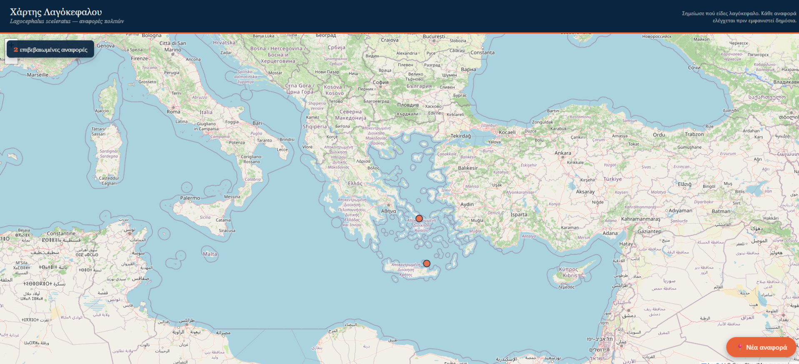

# 🐡 Χάρτης Λαγοκέφαλου — Ελλάδα

**Lagocephalus sceleratus sightings map** · Ένα crowdsourced εργαλείο καταγραφής εμφανίσεων λαγόκεφαλου στις ελληνικές παραλίες, με ζωντανό χάρτη και σύστημα έγκρισης αναφορών.

 

  

## Features

Ο καθένας μπορεί να σημειώσει στον χάρτη πού είδε λαγοκέφαλο — με τοποθεσία, ημερομηνία, περιγραφή και προαιρετική φωτογραφία. Κάθε αναφορά ελέγχεται πριν εμφανιστεί δημόσια, ώστε ο χάρτης να παραμένει αξιόπιστος.

- 📍 **Διαδραστικός χάρτης** της Ελλάδας με ομαδοποίηση (clustering) κουκίδων
- 📝 **Φόρμα αναφοράς**: τοποθεσία στον χάρτη, ημερομηνία, περιγραφή, φωτογραφία
- ✅ **Σύστημα έγκρισης**: κάθε αναφορά ελέγχεται από διαχειριστή πριν δημοσιευτεί
- 🔄 **Ζωντανές ενημερώσεις**: οι εγκεκριμένες αναφορές εμφανίζονται αυτόματα σε όλους, χωρίς refresh
- 📊 **Μετρητής** συνολικών επιβεβαιωμένων αναφορών

## Τεχνολογίες

| Κομμάτι | Τεχνολογία |
|---|---|
| Χάρτης | [Leaflet.js](https://leafletjs.com/) + [Leaflet.markercluster](https://github.com/Leaflet/Leaflet.markercluster) |
| Βάση δεδομένων & Auth | [Supabase](https://supabase.com/) (PostgreSQL, Row Level Security, Storage, Realtime) |
| Frontend | Καθαρό HTML / CSS / JavaScript — χωρίς frameworks |
| Hosting | GitHub Pages |

## Γιατί το έφτιαξα

Στην πανδημία υπήρχαν ζωντανοί χάρτες κρουσμάτων COVID σε πραγματικό χρόνο. Σκέφτηκα να φτιάξω κάτι αντίστοιχο, αλλά για ένα πρόβλημα που αγγίζει τις ελληνικές θάλασσες: τον λαγοκέφαλο, ένα δηλητηριώδες ξενικό είδος που εξαπλώνεται στο Αιγαίο και το Ιόνιο. Είναι το πρώτο μου project πάνω σε web development.

---

<i>Μη επίσημο, εθελοντικό εργαλείο — δεν αντικαθιστά το <a href="https://elnais.hcmr.gr/">ELNAIS</a> ή επιστημονικά δίκτυα παρακολούθησης.</i>

